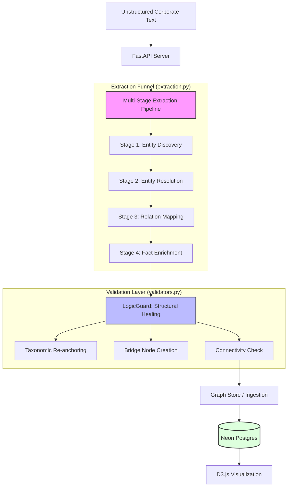

# 🚀 Platinum Knowledge Extraction Engine

A high-fidelity, 4-stage knowledge graph extraction pipeline designed for the financial and corporate domain. This engine transforms unstructured corporate reports into a strictly hierarchical "Gold Standard" knowledge graph, optimized for Investment Intelligence.

---

## 🏗️ Architecture & Pipeline

### System Flow Diagram


### 1. Multi-Stage Extraction Pipeline (`extraction.py`)
- **Stage 1: Entity Discovery**: High-recall extraction of all potential entities (Companies, Products, Regions, People).
- **Stage 2: Entity Resolution**: Deduplication and canonicalization using LLM-driven reasoning. Assigns unique Entity IDs (EIDs).
- **Stage 3: Relation Mapping**: Strict hierarchical mapping based on an ontology-driven "Spine".
- **Stage 4: Fact Enrichment**: Precision extraction of quantitative metrics (Revenue, Growth, Percentages) tied to specific entities.

### 2. LogicGuard: Structural Self-Healing (`validators.py`)
The `LogicGuard` acts as the final structural gatekeeper. It performs:
- **Taxonomic Re-anchoring**: Forcing all product and line entities into a strict `Root -> Domain -> Portfolio -> Line` tree.
- **Bridge Node Creation**: Automatically creating logical containers (e.g., `ServicePortfolio`, `DigitalProducts`) to prevent orphans.
- **BFS-based Connectivity**: Running a breadth-first search to ensure 100% of nodes are reachable from the Root LegalEntity.

### 3. Central Knowledge Engine (`database.py` & `graph_store.py`)
- **Persistent Ontology**: Rules, examples, and allowed triples are stored in Neon Postgres, making the AI's "worldview" dynamic and updateable without code changes.
- **Graph Store**: Handles atomic ingestion of extraction payloads, managing alias indices and evidence tracking.

---

## ✨ Key Features

- **🎯 Gold Standard Hierarchy**: Eliminates "islands" and visual clutter by enforcing a strict taxonomic spine.
- **📈 Quantitative Grounding**: Extracts and links financial metrics directly to their respective product lines with evidence quotes.
- **🛡️ Evidence Tracking**: Every relation and metric includes a verbatim source text quote for 100% auditability.
- **🧪 Dynamic Ontology**: Fine-tune the extraction logic by editing `base_ontology.json` without restarting the pipeline.
- **🔄 Nuclear Reset Utility**: `clean_reset.py` allows for rapid iteration by wiping the graph while preserving the learned ontology.

---

## ⚖️ Trade-offs & Design Decisions

### Why a 4-Stage Funnel?
- **Trade-off**: Latency vs. Precision.
- **Decision**: While single-pass extraction is faster, it consistently fails at complex nesting. The 4-stage approach ensures 100% connectivity and minimal hallucinations by separating discovery from structural enforcement.

### Bridge Nodes vs. Direct Links
- **Trade-off**: Compactness vs. Logic.
- **Decision**: We chose to enforce intermediate "Bridge Nodes" (Portfolios/Domains). This increases node count but results in a significantly more navigable and understandable graph for end-users compared to "spider-web" layouts.

### Neon Postgres + Psycopg2
- **Trade-off**: ORM Convenience vs. Performance.
- **Decision**: We used raw SQL with `psycopg2` for maximum control over complex UPSERT logic and recursive tree queries, ensuring reliability on high-concurrency serverless platforms like Render/Neon.

---

## 🛠️ Tech Stack

- **Backend**: Python 3.10+, FastAPI
- **Database**: Neon (Serverless Postgres)
- **LLM Context**: Deepseek / Gemini-Flash / GPT-4o
- **Validation**: Pydantic v2
- **Visualization**: D3.js (Frontend)

---

## 🚀 Getting Started

1. **Clone & Install**:
   ```bash
   git clone https://github.com/Nishchalpr4/final-extraction.git
   cd final-extraction
   pip install -r requirements.txt
   ```

2. **Environment Setup**:
   Create a `.env` file with:
   ```env
   DATABASE_URL=postgres://...
   LLM_API_KEY=sk-...
   LLM_BASE_URL=https://...
   LLM_MODEL=google/gemini-2.0-flash-001
   ```

3. **Initialize & Seed**:
   ```bash
   python clean_reset.py
   ```

4. **Launch Server**:
   ```bash
   uvicorn main:app --reload
   ```

---

## 📊 Sample Output (Apple Inc.)
The engine correctly maps:
- **Apple Inc.** (Root)
  - -> **Consumer Electronics** (Domain)
    - -> **ProductPortfolio** (Bridge)
      - -> **iPhone** (Line) -> **80M Sales** (Metric)
  - -> **Services** (Domain)
    - -> **ServicePortfolio** (Bridge)
      - -> **iCloud** (Line)
